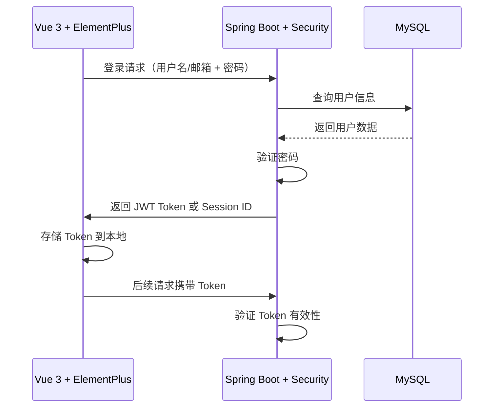

### 功能说明
围绕登录、注册、密码重置核心流程，构建基础认证体系，支持基于用户名/邮箱的登录校验、邮箱注册流程、邮箱重置密码功能，同时通过前后端协作实现路由权限控制，保障未登录态下访问受限页面自动跳转登录，以及异常页面访问的合理兜底。

### 一、功能拆解与逻辑梳理
#### 1. 登录功能（多方式 + 状态校验）
- **核心逻辑**：  
  支持用户通过**用户名**作为身份标识完成登录，登录成功后需限制页面访问权限（仅登录用户可访问`index`路径页面 ）；未登录用户访问受限页面时，自动重定向至登录界面；若访问不存在页面，已登录则回退到`index`首页，未登录则跳转登录页。  
  ```mermaid
  graph TD
    A[用户访问页面] --> B{页面是否存在?}
    B -->|存在| C{是否登录?}
    B -->|不存在| D{是否登录?}
    C -->|已登录| E[进入目标页面]
    C -->|未登录| F[跳转登录页]
    D -->|已登录| G[跳转index首页]
    D -->|未登录| F[跳转登录页]
  ```

#### 2. 注册功能（邮箱驱动）
- **核心逻辑**：  
  用户通过邮箱完成注册流程，需校验邮箱唯一性，注册成功后可直接关联登录态（或引导登录 ），流程包含「邮箱验证码发送→填写注册信息→校验提交」环节。  
  ```mermaid
  sequenceDiagram
    participant 前端 as 前端
    participant 后端 as 后端
    前端->>后端: 请求发送注册邮箱验证码
    后端->>前端: 发送验证码（邮箱通道）
    前端->>后端: 提交注册信息（含邮箱、验证码、密码等）
    后端->>后端: 校验验证码、邮箱唯一性
    后端->>前端: 注册结果反馈（成功/失败）
  ```

#### 3. 密码重置功能（邮箱验证）
- **核心逻辑**：  
  基于邮箱找回密码，需验证用户邮箱所有权（通过验证码 ），验证通过后允许重置密码，流程为「请求重置→发送邮箱验证码→提交新密码」。  
  ```mermaid
  sequenceDiagram
    participant 前端 as 前端
    participant 后端 as 后端
    前端->>后端: 发起密码重置（提交邮箱）
    后端->>前端: 发送重置验证码（邮箱通道）
    前端->>后端: 提交新密码 + 验证码
    后端->>后端: 校验验证码、更新密码
    后端->>前端: 重置结果反馈（成功/失败）
  ```

#### 4. 登录状态校验方案（前后端协作）
- **核心逻辑**：  
  前端统一通过**主动请求用户信息接口**判断登录状态：请求成功则判定为已登录，保留/进入目标页面；请求失败则判定为未登录，跳转登录页重新认证。  
  ```mermaid
  graph TD
    A[页面加载/路由切换] --> B[前端请求用户信息接口]
    B -->|响应成功| C[判定已登录，正常访问]
    B -->|响应失败| D[判定未登录，跳转登录页]
  ```

  ### 技术栈说明

本项目采用现代化的前后端分离架构，技术栈覆盖前端、后端、数据库及相关工具链，支持快速开发与二次扩展。以下是完整的技术栈描述及各层组件的协作方式：


### 二、后端技术栈

#### 1. **Spring Boot 3.0**
- **核心框架**：提供自动配置、依赖管理，简化项目搭建与部署
- **组件**：
  - **Spring Web**：基于注解的 RESTful API 开发
  - **Spring Security**：提供认证、授权、CSRF 防护等安全功能
  - **Spring Data JPA/MyBatis**：数据库访问层，支持对象关系映射
  - **Spring Validation**：请求参数校验
  - **Spring Mail**：邮件发送服务（用于注册、重置密码）
  - **Spring Cache**：缓存抽象层（可集成 Redis）

#### 2. **数据库与缓存**
- **MySQL**：主数据库存储用户信息、业务数据
- **Redis**：缓存登录会话、验证码等临时数据
- **Navicat**：管理数据库

#### 3. **工具链**
- **Maven**：项目构建与依赖管理
- **Lombok**：减少样板代码，提升开发效率
- **FastJSON**：JSON 序列化/反序列化工具


### 二、前端技术栈

#### 1. **Vue.js 3.0**
- **核心框架**：采用 Composition API + JavaScript，提升代码组织与可维护性
- **生态组件**：
  - **Vue Router**：单页面应用路由管理
  - **Pinia**：新一代状态管理库，替代 Vuex
  - **Vue CLI**：项目脚手架工具
  - **VueUse**：实用 Composition API 工具集

#### 2. **UI 框架**
- **ElementPlus**：基于 Vue 3 的企业级 UI 组件库
- **Tailwind CSS**：原子化 CSS 框架，快速定制样式
- **Font Awesome**：图标库，提供丰富的图标资源

#### 3. **HTTP 客户端**
- **Axios**：基于 Promise 的 HTTP 客户端，处理前后端数据交互
- **拦截器**：统一处理请求头（如添加 Token）、响应错误

#### 4. **构建工具**
- **Vite**：新一代前端构建工具，提升开发体验
- **ESLint + Prettier**：代码质量与风格统一


### 三、前后端协作机制

#### 1. **认证流程**


#### 2. **权限控制**
- **前端**：通过路由守卫（Vue Router）拦截未授权访问
- **后端**：基于 Spring Security 配置接口访问权限
- **协作**：前端请求用户信息接口（如 `/api/user/me`）验证登录状态


### 四、部署与扩展

#### 1. **容器化部署**
- **Docker**：打包前后端应用为容器


